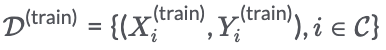
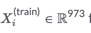
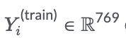

# Team Atom

# Solution to CTD-squared Chemogenomic DREAM Challenge by Team Atom

### Authors
Tingzhong Tian^1^  (tiantz17@mails.tsinghua.edu.cn), Fangping Wan^1^ (wfp15@mails.tsinghua.edu.cn), Shuya Li^1^ (lishuya17@mails.tsinghua.edu.cn), Yuanpeng Xiong^1^ (yuanpengxiong@foxmail.com) and Jianyang Zeng^1^ (zengjy321@tsinghua.edu.cn)

1: Institute for Interdisciplinary Information Sciences, Tsinghua University, Beijing, China.

## 1 Summary

This project contains the method from team Atom, for both sub-challenges of CTD-squared Chemogenomic DREAM Challenge. In this project, we describe how to predict drug targets from chemogenomic data, with an ensemble of neural network models trained using the LINCS L1000 data [1].

## 2 Data process


### 2.1 Training data and labels

The training data  used in our framework contains the compound-perturbed gene expression feature $ from LINCS L1000 platform as well as the corresponding drug targets  of one-hot encoding representation, where C stands for the set of compounds.

For each compound $i$, a gene expression feature is calculated from Level 5 data of LINCS L1000 platform of phase I (GSE92742) and phase II (GSE70138).
To obtain a consensus gene expression feature $X_i^{(\text{train})}$ for compound i without considering other conditions including cell lines, dose and time, all the Level 5 signatures corresponding to compound i were selected and averaged using MODZ algorithm introduced in L1000 paper.

Target-knockdown gene expression features were obtained in a similar way.

The targets of compound $i$ were obtained from DrugBank (https://www.drugbank.ca/) and ChEMBL (https://www.ebi.ac.uk/chembl/) databases. Drug-target pairs in DrugBank database and compound-protein pairs with affinity lower than 1uM in ChEMBL database were defined as positive samples. In total, 2002 drugs and 769 targets were used as training data in our framework.

### 2.2 Test data

The expressions of overlapped genes of L1000 landmark genes and plate-seq genes were used as the inputs to our model in both training and testing, that is 973 genes.
Similar to training data, the gene expression profiles of test drugs were processed using first ZSPC and then MODZ.

Let $X^{(\text{test})}$ denote the gene expression profile of plate-seq data.
Then the z-score with population control (ZSPC) signature of drug $i$ was calculated by

$$ X^{(\text{ZSPC})} = \frac{X^{(\text{test})} - \text{median}(X^{(\text{test})})}{1.4826 \cdot \text{MAD}(X^{(\text{test})})} $$,
where $\text{MAD}$ stands for median absolute deviation, $1.4826$ was used for standarization.

To ignore the conditions including cell lines, dose and time, all the signatures $X_i^{(\text{ZSPC})}$ corresponding to drug $i$ were averaged using MODZ algorithm and acted as test data $\mathcal{D}^{(\text{test})} = \{ X_i^{(\text{test})} \}$.

The predicting values for the remaining targets (i.e., outside of 769 targets in the training data) were set to zeros.


### 2.3 Target similarities
Two similarity matrics for targets are also used by our model. One is sequence similarity. Protein seqeuces are obatined from UniProt according to their gene IDs. Then, the Smith-Waterman sequence alignment scores are computed by an alignment tool (https://github.com/mengyao/Complete-Striped-Smith-Waterman-Library). The sequence similarity between two proteins ia then defined as the normalized alignment scores, that is, $$\( \frac{sw(s_1, s_2)}{\sqrt{sw(s_1, s_1) \times sw(s_2, s_2)}}  \)$$, where $$\( sw(s_1, s_2) \)$$ stands for the alignment score between protein sequences  $$\( s_1 \)$$ and  $$\( s_2 \)$$. The other is the genomic similarity, which is defined as the $max$ (Pearson's correlation between two target-knockdown gene expression features, 0). We averaged these two matrics and constructed a KNN (K=10) graph as our final target similarity graph.

## 3 Model
### 3.1 Network architecture
Single-layer neural network (ReLU activation function) with layer normalization [2] and dropout (dropout rate = 0.1) [3] is used to model the relationship between $X_i$ and $Y_i, i \in \mathcal{C}$.

We adopt a Bayesian Personalized Ranking (BPR) loss [4] and a multitask constraint loss [5] to train the parameters of our model.

Specifically, let $S_{i,j}$ denote the predicted score between drug $i$ and  target $j$ produced by our model.   BPR loss is defined as: BRP_Loss = -log($S_{i,j} - S_{i, k}$), where target $j$ is the known target of drug $i$ while target $k$ isn't. During neural network training, we sample a batch (batch size = 256) of drug $i$, and for each drug $i$, we sample pairs (i, j) and (i,k) to perform foward and backward propagation.

The multitask constraint loss is defined as: Multitask_Loss =  $trace(W L W^T)$, where $W$ is the learnable parameter of the last layer of the neural network, $L$ is the normalized graph laplacian of the target similarity graph defined in Section 2.3.

We use BPR_Loss + $\lambda_1$Multitask_Loss + $\lambda_2$L2_Loss to train our neural network model. Here, L2_Loss is the weight decay for controlling the model complexity, $\lambda_1$ and $\lambda_2$ are used to balance different weights. The loss is optimized by Adam optimizer with learning rate = 0.001.

### 3.2 Train/Valid/Test split

We used 10-fold cross validation scheme to train models. For each fold, 1/10 of the drugs were used as test data while the remaining 9/10 drugs were used as training data. Among training data, 1/10 of drugs were left out as validation data. This strategy is used to perform hyperparameter selection (including,  dropout rate, $\lambda_1$, $\lambda_2$, hidden size of the neural network, training epoch).

### 3.3 Early stopping

We used early stopping to prevent overfitting. For each epoch, we compare the model performance on validation data with the best performance. If the performance no longer improves, the number of no-improvement epoches would be accumulated otherwise reset to zero. The training process would be stopped as long as the number of no-improvement epoches exceeds a threshold named patience. We used a patience of 100 here.

### 3.4 Ensemble model

We use ensemble learning approach to further boost the performance. We set constuct 100 different nerual network models from \{$\lambda_1$ = 0.0001, 0.00001\} $\times$ \{$\lambda_2$ = 0.0001\} $\times$ {hidden size of neural network = 256, 512, 1024, 2048, 4096} $\times$ {10 different folds (see Section 3.2)}. We then average the prediction scores from these model to produce the final scores.

### 3.5 MinMax normalization
The final predicting scores of each drug were min-max normalized to the range of 0-1 if the minimum value was below 0 or the maximum value was above 1.


## 4 Run our model

One GPU is needed to train our model, so please specify the GPU ID in the command. You can either use our saved model parameters or train the model parameters. Note that if you choose to train our model, the outputs for different runs may vary a litte due to random samplings during the training process.

Pull the docker image:
```
docker pull docker.synapse.org/syn21560898/ctd2_atom:v1
```

Run our docker container and use saved model parameters (may need several minutes):
```
docker run -it --rm -v ${PWD}/input:/workspace/input -v ${PWD}/output:/workspace/output -e GPU_NO="0" -e LOAD_MODEL="load" --runtime=nvidia docker.synapse.org/syn21560898/ctd2_atom:v1
```

Run our docker container and train our model (may need 5--6 hours):
```
docker run -it --rm -v ${PWD}/input:/workspace/input -v ${PWD}/output:/workspace/output -e GPU_NO="0"  --runtime=nvidia  docker.synapse.org/syn21560898/ctd2_atom:v1
```

[1] Subramanian A, Narayan R, Corsello S M, et al. A next generation connectivity map: L1000 platform and the first 1,000,000 profiles[J]. Cell, 2017, 171(6): 1437-1452. e17.
[2] Ba, Jimmy Lei, Jamie Ryan Kiros, and Geoffrey E. Hinton. "Layer normalization." arXiv preprint arXiv:1607.06450 (2016).
[3] Srivastava, Nitish, et al. "Dropout: a simple way to prevent neural networks from overfitting." The journal of machine learning research 15.1 (2014): 1929-1958.
[4] Rendle, Steffen, et al. "BPR: Bayesian personalized ranking from implicit feedback." arXiv preprint arXiv:1205.2618 (2012).
[5] Zhou, Jiayu, Jianhui Chen, and Jieping Ye. "Malsar: Multi-task learning via structural regularization." Arizona State University 21 (2011).
