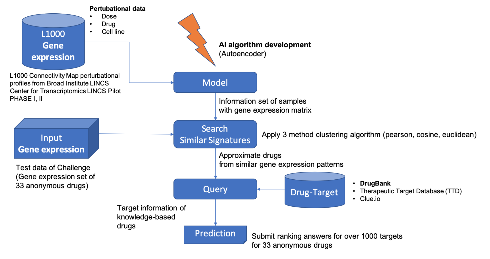

# Team Theragen

# Drug target prediction using gene expression similarity and knowledge target

Jeein Oh^1^, Seong-Eui Hong^1^, Chang ji won^1^, Jeong seong hun^1^, Hyunmin Kim^1^
1. Theragen Etex Bio Institute, Gyeonggi-do, Korea.

## Summary Sentence
Our method looks for drug / shRNA information that is already known and suggests a target that has a pattern similar to a given gene expression pattern for drugs that do not know the target information.

## Background/Introduction
We’ve been figuring out the intend of the examiners. Through the reflection of suggested several theses, we are inspired of the paper, Szalai et al.,. It’s commonly known there were many of research related to cell viabiaily, which is the key for this project to clue the method for discovery of similarity in accordance with gene signature even further prediction of the target.
	In the limited time, this project can have a clue that the data preprocessing method in the suggested Szalai et al., is the same for the published data from the competition by browsing “New Training Data Available” in the Discussion section, and with this data we first derive results in the leaderboard submission in a timely manner.    
	In conclusion, this project proposed the target derived from information of the known drugs and shRNA in the present that has similar gene expression with the given gene expression. This project was to develop deep-learning model including the features with the training data, and the gene expression data given in the competition was appiled to the developed model, which was available to secure the information of drugs and shRNA that have the most similarity. If applied to the drug that has a known target, it proposed the applicable target. Yet if it’s similar to shRNA, it aims to the target that was knockdowned in the shRNA pertubation.
	This project dedicates to conclude an optimal deep-learning model performed with the most features of the training data. It concentrates on not only repurposing of the model but also securing the target information based on the reputable knowledges such as the other drug-target database (e.g., Drugbank).

## Methods

### Data
From (https://github.com/bence-szalai/Data-preparation-for-CTD2), we use the “consensus_signature_drugs.csv” and “consensus_signature_shRNA.csv”. This file generated by using Level5 gene expression profiles in L1000 database. The drug-target information and meta information downloaded from The Drug Repurposing Hub. (https://clue.io/repurposing)
We two signature files merged into one.

### Train data & Model
We made an variational autoencoder(VAE) model using drug and shRNA perturbation (gene expression profile).
VAE has 3 hidden layers with size [ 700 , 650 , 600 , 470 ], so size of gene expression is 973 and we add padding zero 3 times.
Total input size is 976.  activation function is elu, and optimizer is Adam with 0.0002 learning rate.

### Test data
To comparison, we convert test data that is from challenge(gene expression data of 33 anonymous drugs) into the form of autoencoder model encoding we created earlier.

### Similarity calculation
Similarity calculation between the trained autoencoder model and the test data model was calculated in three ways using Scipy python package.
-	Correlation (Pearson)
-	Cosine
-	Euclidean

For the drug/shRNA information similarly found using the close range ranking 1~1000 calculated by each calculation method, If the drug was found in the repurposing app, if the suggested target was shRNA, the knockdown gene information was collected. Each target list was counted after consolidation and we made a score using the average of the calculated module similarity used in the previous step as a weight. The min/max scale was applied to the scores. Finally, the results were presented by applying a custom weighted averaging method.
Custom weighted averaging method: np.exp(1.4*(1-dist_score[i] )-0.5)

## Conclusion/Discussion
Gene expression profile is a major signature for MoA, as evidenced by previous researches. With the premise that if we have similar signatures, we will have similar MoAs and thus share similar targets, so we wanted to find the drugs based on signatures. In addition, as shown in the study of L1000, shRNA data of RNAi experiments, can grasp information about targets of perturbation. Adding more data of CTRP and Achilles to get more pertubations on more compounds and shRNAs, and adding knowledge based targets will yield better results.

## References

1. CTD-squared Pancancer Drug Activity DREAM Challenge (syn21540815)

2. Szalai, B., Subramanian, V., Holland, C., Alföldi, R., Puskás, L., Saez-Rodriguez, J. (2019). Signatures of cell death and proliferation in perturbation transcriptomics data—from confounding factor to effective prediction Nucleic Acids Research  47(19), 10010-10026. https://dx.doi.org/10.1093/nar/gkz805

3. Subramanian, A., Narayan, R., Corsello, S., Peck, D., Natoli, T., Lu, X., Gould, J., Davis, J., Tubelli, A., Asiedu, J., Lahr, D., Hirschman, J., Liu, Z., Donahue, M., Julian, B., Khan, M., Wadden, D., Smith, I., Lam, D., Liberzon, A., Toder, C., Bagul, M., Orzechowski, M., Enache, O., Piccioni, F., Johnson, S., Lyons, N., Berger, A., Shamji, A., Brooks, A., Vrcic, A., Flynn, C., Rosains, J., Takeda, D., Hu, R., Davison, D., Lamb, J., Ardlie, K., Hogstrom, L., Greenside, P., Gray, N., Clemons, P., Silver, S., Wu, X., Zhao, W., Read-Button, W., Wu, X., Haggarty, S., Ronco, L., Boehm, J., Schreiber, S., Doench, J., Bittker, J., Root, D., Wong, B., Golub, T. (2017). A Next Generation Connectivity Map: L1000 Platform and the First 1,000,000 Profiles Cell  171(6), 1437 1452.e17. https://dx.doi.org/10.1016/j.cell.2017.10.049

4. Bush, E., Ray, F., Alvarez, M., Realubit, R., Li, H., Karan, C., Califano, A., Sims, P. (2017). PLATE-Seq for genome-wide regulatory network analysis of high-throughput screens Nature Communications  8(1), 105. https://dx.doi.org/10.1038/s41467-017-00136-z

5. https://clue.io/connectopedia/pdf/what_is_a_cgs

## Authors Statement
KHM: planning strategy, code development
OJI: data preprocessing
HSE: planning strategy, code development
CJW: pharmacist, planning strategy
JSH: data preparation
